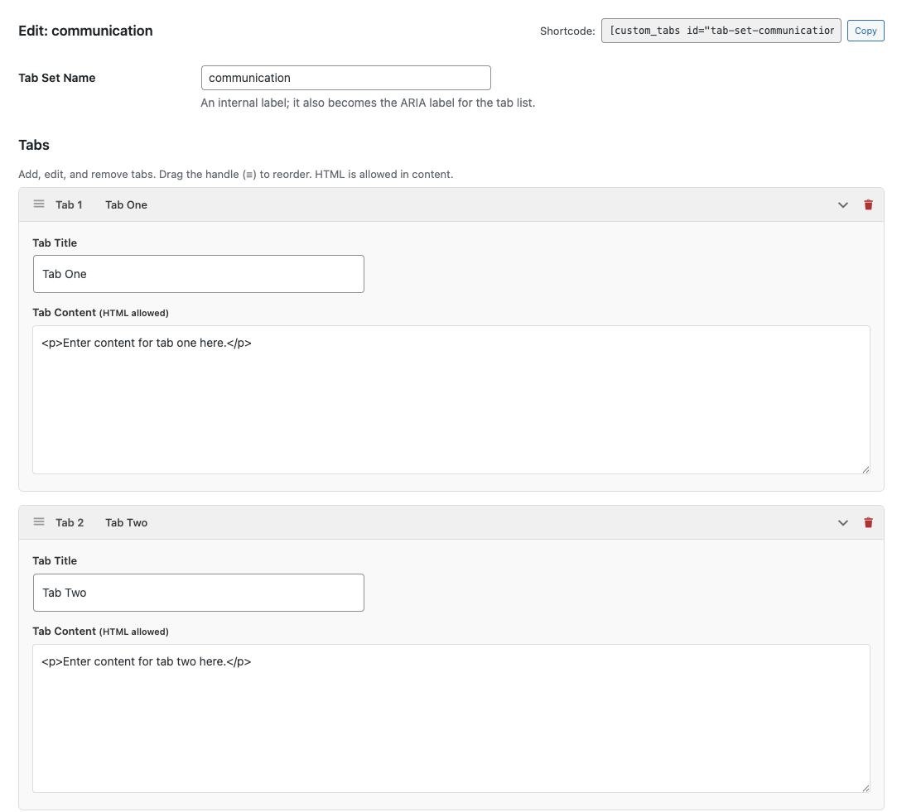

# Wordpress tabbed navigation custom plugin    

## Usage Instructions    
### Installation    
Create the folder wp-content/plugins/custom-tabs-shortcode/    
Place all files in their respective paths    
Activate the plugin in Plugins → Installed Plugins  

### Plugin File Structure  
```
wp-content/plugins/custom-tabs-shortcode/
├── custom-tabs-shortcode.php
├── admin/
│   ├── admin-page.php
│   └── admin-assets.css
└── assets/
    ├── tabs-style.css
    └── tabs-script.js
```      

### Creating Tabs        
Go to Custom Tabs in the WordPress admin menu    
Click "+ Create New Tab Set"     
Enter a name, add/edit tabs with titles and HTML content   
Click Save Tab Set   
Copy the generated shortcode   

### Using the Shortcode    
```
[custom_tabs id="tab-set-1"]
```    
Place this shortcode in any post, page, or widget that supports shortcodes.    

### Features       
- Embed tabbed content anywhere with [custom_tabs id="your-id"] — works in posts, pages, widgets, and template files    
- Unlimited Tab Sets    
- Create as many independent tab groups as needed, each with its own unique ID and shortcodeUnlimited Tabs Per Set    
- Each tab set can hold any number of individual tabs   
- HTML Content Support   
- Tab content accepts full HTML (filtered through wp_kses_post for security)   

### License
Apache License 2.0

### Admin UI

